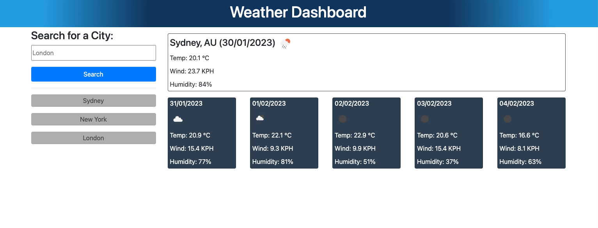

# challenge-8-weather-dashboard

## Description 

This website presents a weather dashboard which allows the user to see basic weather conditions at the entered location.

Functionality was built using Javascript, which enables the user to look up a city or country, which, upon clicking the search button or submitting the entry, displays the city and/or country name, the current date, as well as the temperature, wind speed and humidity. The same data is then displayed for the next 5 days at the searched location.

Searched cities are then saved in a list of buttons that the user can click again to retrieve the weather data again at those locations. The list of cities and buttons are then saved to local storage so they persist through webpage refreshes. 

Moment.js was used to obtain current date based on user location. It was also used to 

## Website link:

[https://ionb23.github.io/challenge-8-weather-dashboard/](https://ionb23.github.io/challenge-8-weather-dashboard/)

## Website demo screenshot:

---

© 2022 edX Boot Camps LLC. Confidential and Proprietary. All Rights Reserved.